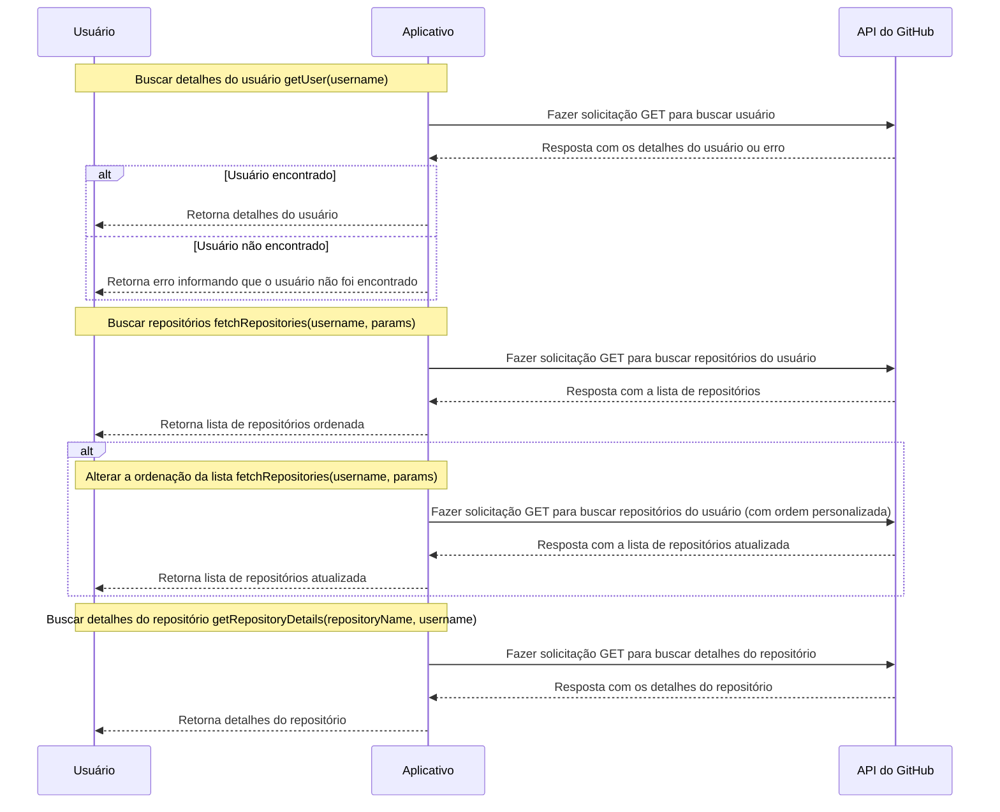

[//]: # ([![MIT License]&#40;https://img.shields.io/apm/l/atomic-design-ui.svg?&#41;]&#40;https://github.com/tterb/atomic-design-ui/blob/master/LICENSEs&#41;)
[](https://github.com/mpluiz/git-hunter/actions/workflows/ci.yml)


# GITHUNTER

- [app](https://githunter.marcosluiz.dev)
- [storybook](https://storybook.githunter.marcosluiz.dev)

## Roadmap

- Pagination Resources
- E2E Test with Cypress
- Internationalization with i18n

## Requirements
- Node `<lts-version>`

## Environment Variables

Required*

`VITE_GITHUB_BASE_URL`*

`VITE_APP_URL`

`VITE_SENTRY_DNS`

## Installation

Instructions to install dependencies and start the dev server\
put required variables in the `env` file*

```bash
cd <your-project-name>
npm i
cp .env-example .env
npm run dev
```

## Tests

Instructions to run tests

```bash
  npm run test
```

Commands for tests

```bash
  npm run test:watch
  npm run test:ui
  npm run test:ci
```

Coverage Report

```bash
  npm run test:coverage
```

## Storybook

Instructions to start storybook

```bash
  npm run storybook
```

## Documentation

- [usecases](/docs/usecases.md)

### Architecture

The architecture used in this project was the Clean Architecture, using the concepts proposed by Roberto Martin.


```
src/
  application/
    mappers/
    protocols/
    services/
    usecases/
  domain/
    entities/
    usecases/
  infra/
    cache/
    http/
  main/
    adapters/
    factories/
    routes/
  presentation/
    assets/
    components/
    hooks/
    pages/
tests/
    factories/
    services/
```

### Diagram



## Documentation reference
- [The Clean Architecture](https://blog.cleancoder.com/uncle-bob/2012/08/13/the-clean-architecture.html)
- [Typescript](https://www.typescriptlang.org/docs/)
- [React](https://react.dev/reference/react)
- [React Router](https://reactrouter.com/en/main/start/overview)
- [Testing Library](https://testing-library.com/docs/react-testing-library/intro/)
- [Vite](https://vitejs.dev/guide/)
- [Vitest](https://vitest.dev/guide/)
- [Github API](https://docs.github.com/en/rest/guides/getting-started-with-the-rest-api?apiVersion=2022-11-28)

## How to contribute

- Make a fork of this repository;
- Create a branch with your feature: `git checkout -b <your-branch>`;
- Make a commit : `git commit -m '<commit-message>'`;
- Push to your branch: `git push <origin> your-branch`;

## License

[MIT](https://choosealicense.com/licenses/mit/)
