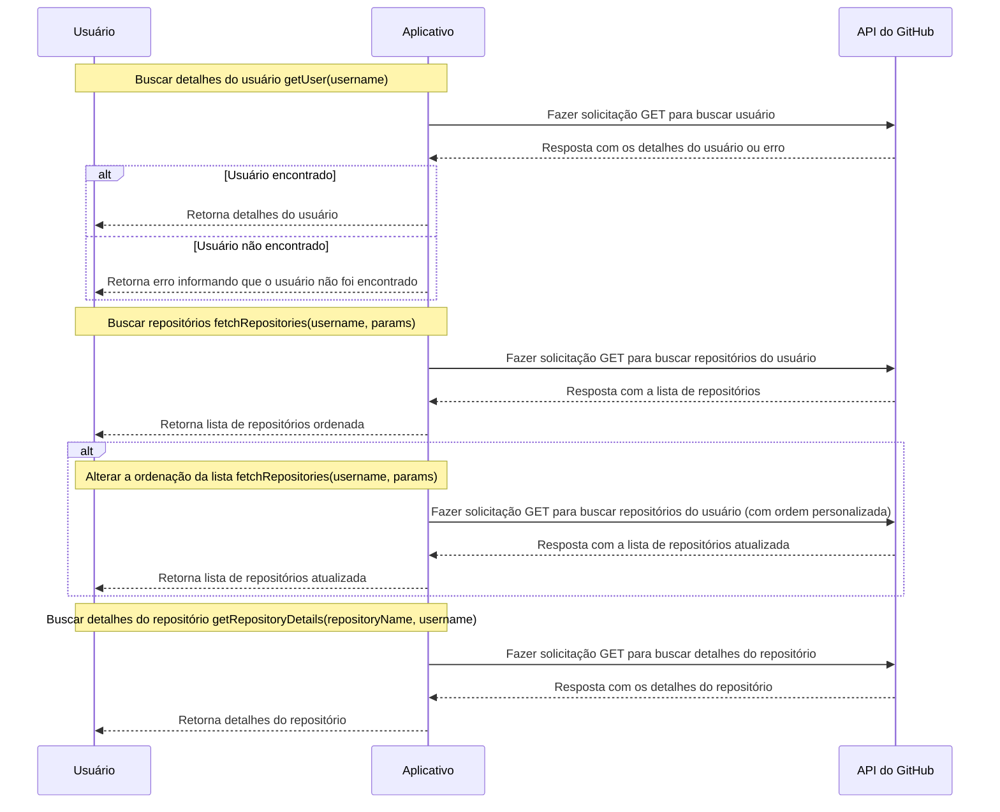

```mermaid
sequenceDiagram
  participant User as Usuário
  participant App as Aplicativo
  participant GitHubAPI as API do GitHub

  Note over User, App: Buscar detalhes do usuário getUser(username)
  App->>GitHubAPI: Fazer solicitação GET para buscar usuário
  GitHubAPI-->>App: Resposta com os detalhes do usuário ou erro
  alt Usuário encontrado
    App-->>User: Retorna detalhes do usuário
  else Usuário não encontrado
    App-->>User: Retorna erro informando que o usuário não foi encontrado
  end

  Note over User,App: Buscar repositórios fetchRepositories(username, params)
  App->>GitHubAPI: Fazer solicitação GET para buscar repositórios do usuário
  GitHubAPI-->>App: Resposta com a lista de repositórios
  App-->>User: Retorna lista de repositórios ordenada

  alt
    Note over User, App: Alterar a ordenação da lista fetchRepositories(username, params)
    App->>GitHubAPI: Fazer solicitação GET para buscar repositórios do usuário (com ordem personalizada)
    GitHubAPI-->>App: Resposta com a lista de repositórios atualizada
    App-->>User: Retorna lista de repositórios atualizada
  end

  Note over User, App: Buscar detalhes do repositório getRepositoryDetails(repositoryName, username)
  App->>GitHubAPI: Fazer solicitação GET para buscar detalhes do repositório
  GitHubAPI-->>App: Resposta com os detalhes do repositório
  App-->>User: Retorna detalhes do repositório
```
